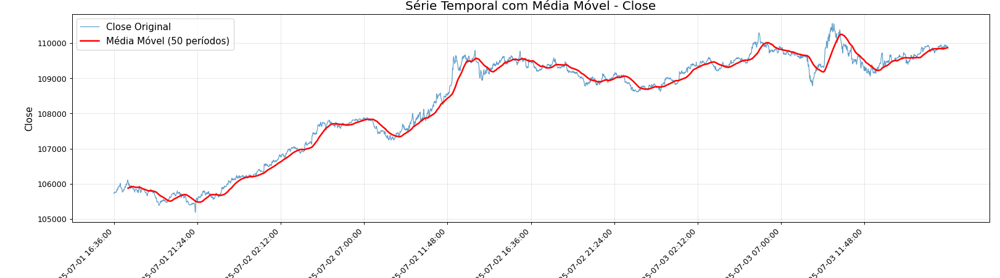

# Projeto Final de Estrutura de Dados: Análise de Bitcoin com Pilhas e Filas

**Disciplina:** Estrutura de Dados (GES-115) - UFLA  
**Autor:** João Paulo Assis Bonifácio  
**Data:** 04/07/2025  

## 📋 Visão Geral

Este projeto demonstra a aplicação prática das estruturas de dados **Filas (FIFO)** e **Pilhas (LIFO)** na análise de séries temporais de Bitcoin, utilizando conceitos de **Online Machine Learning**. O objetivo é mostrar como essas estruturas fundamentais podem ser usadas para processar dados financeiros de forma eficiente, calculando médias móveis e detectando valores críticos.

## 🎯 Objetivos

- **Aplicar estruturas de dados** em problemas reais de análise financeira
- **Implementar algoritmos eficientes** para processamento de séries temporais
- **Demonstrar vantagens** de filas e pilhas em diferentes cenários
- **Analisar complexidade** temporal e espacial dos algoritmos
- **Visualizar resultados** através de gráficos interativos

## 🗂️ Estrutura do Projeto

```
trabalho_final_estrutura_de_dados/
├── 📊 dados/
│   └── db_bitcoin_1dia.csv          # Dataset com preços Bitcoin (2880 registros)
├── 📁 scrips_python/
│   ├── estrutura_fila_bitcoin.py    # Implementação da classe FilaDeslizante
│   ├── 1_carregar_dados_iniciais.py # Carregamento e pré-processamento
│   ├── 2_atualizar_dados_continuamente.py # Atualização contínua
│   └── implementacao.py             # Implementações principais
├── 📁 oml_scripst/
│   ├── janelas_deslizantes_filas.py # Médias móveis com filas
│   ├── detecao_extremos_pilhas.py   # Detecção de extremos com pilhas
│   ├── analise_completa.py          # Análise consolidada
│   └── README.md                    # Documentação específica OML
├── 📁 shiny/
│   ├── media_movel.py               # Aplicação interativa - médias móveis
│   └── valores_criticos.py          # Aplicação interativa - valores críticos
├── 📁 img/
│   ├── 1.png                        # Visualização médias móveis
│   └── 2.png                        # Visualização valores críticos
├── 📁 instructions/
│   ├── ideia.md                     # Concepção inicial do projeto
│   └── rules.md                     # Regras da disciplina
├── 📄 apresentacao.qmd              # Apresentação em Quarto
├── 📄 Relatorio.qmd                 # Relatório técnico
└── 📋 requirements.txt              # Dependências Python
```

## 🚀 Instalação e Configuração

### Pré-requisitos

- Python 3.8+
- pip (gerenciador de pacotes Python)

### Instalação

1. **Clone ou baixe o projeto:**
```bash
git clone <url-do-repositorio>
cd trabalho_final_estrutura_de_dados
```

2. **Instale as dependências:**
```bash
pip install -r requirements.txt
```

3. **Dependências principais:**
```
pandas>=1.5.0      # Manipulação de dados
numpy>=1.21.0      # Computação numérica
scikit-learn>=1.1.0 # Machine Learning
matplotlib>=3.5.0   # Visualização
```

## 📊 Base de Dados

**Fonte:** [Financial Modeling Prep API](https://financialmodelingprep.com/)  
**Conteúdo:** Preços de Bitcoin em dólares americanos (BTC/USD)  
**Período:** 2 dias completos (1 registro por minuto)  
**Total:** 2.880 registros  
**Formato:** CSV com colunas `Date` e `Close`

## 🔧 Funcionalidades Principais

### 1. 📈 Médias Móveis com Filas (FIFO)

**Estrutura:** `collections.deque` com tamanho máximo fixo  
**Algoritmo:** Janela deslizante para cálculo eficiente de médias

```python
# Pseudocódigo
janela = Fila(tamanho=n)
para cada preço na série:
    janela.enfileirar(preço)
    se janela.está_cheia():
        média = calcular_média(janela)
        processar_média(média)
```

**Aplicações:**
- Janela curta (15 min): Detecção de movimentos rápidos
- Janela média (60 min): Análise de tendências horárias  
- Janela longa (240 min): Identificação de padrões de longo prazo

**Complexidade:**
- **Tempo:** O(N × n) onde N = tamanho da série, n = tamanho da janela
- **Espaço:** O(n) - eficiente em memória

### 2. 🔍 Detecção de Valores Críticos com Pilhas (LIFO)

**Estrutura:** `list` com operações `append()` e `pop()`  
**Algoritmo:** Pilhas de máximos e mínimos para detectar extremos

```python
# Pseudocódigo para pilha de máximos
pilha_max = Pilha()
para cada preço na série:
    enquanto pilha_max não vazia E topo < preço:
        pilha_max.desempilhar()
    pilha_max.empilhar(preço)
```

**Aplicações:**
- Identificação de picos (máximos locais)
- Detecção de vales (mínimos locais)
- Análise de volatilidade

**Complexidade:**
- **Tempo:** O(N) melhor caso, O(N²) pior caso
- **Espaço:** O(1) melhor caso, O(N) pior caso

## 💻 Como Executar

### Análise Básica

```bash
# Executar análise de médias móveis
python oml_scripst/janelas_deslizantes_filas.py

# Executar detecção de extremos
python oml_scripst/detecao_extremos_pilhas.py

# Executar análise completa
python oml_scripst/analise_completa.py
```

### Aplicações Interativas

```bash
# Interface para médias móveis
python shiny/media_movel.py

# Interface para valores críticos  
python shiny/valores_criticos.py
```

### Implementação do Zero

```bash
# Carregar dados iniciais
python scrips_python/1_carregar_dados_iniciais.py

# Processar dados continuamente
python scrips_python/2_atualizar_dados_continuamente.py
```

## 📊 Resultados e Visualizações

### Médias Móveis

- Suavização de ruído nos dados
- Identificação clara de tendências
- Comparação entre diferentes janelas temporais

### Valores Críticos

- Pontos de máximo marcados com ▲ vermelho
- Pontos de mínimo marcados com ▼ verde
- Identificação de padrões de volatilidade


## 🎓 Conceitos Demonstrados

### Estruturas de Dados
- **FIFO (First In, First Out):** Filas para processamento sequencial
- **LIFO (Last In, First Out):** Pilhas para análise de padrões


## 📖 Referências

- [Médias Móveis - Wikipedia](https://en.wikipedia.org/wiki/Moving_average)
- [Teoria de Valores Extremos - Wikipedia](https://en.wikipedia.org/wiki/Extreme_value_theory)
- [Shiny for Python](https://shinylive.io/py/)
- [Online Machine Learning](https://www.amazon.com/Online-Machine-Learning-Methodologies-Applications/dp/9819970067) - Eva Bartz e Thomas Bartz-Beielstein

## 🎯 Contexto Acadêmico

**Disciplina:** Estrutura de Dados (GES-115)  
**Instituição:** Universidade Federal de Lavras (UFLA)  
**Período:** 3º Período  
**Peso:** 40 pontos (projeto) + 10 pontos (apresentação)

